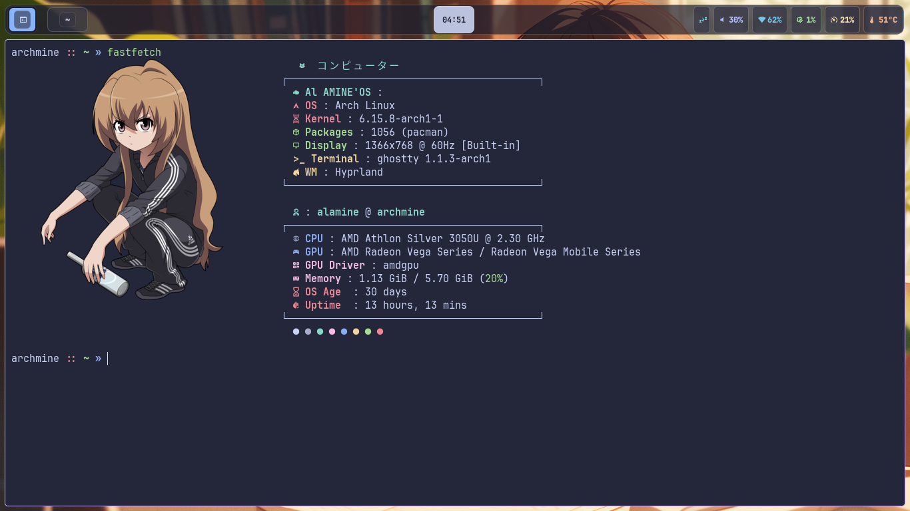
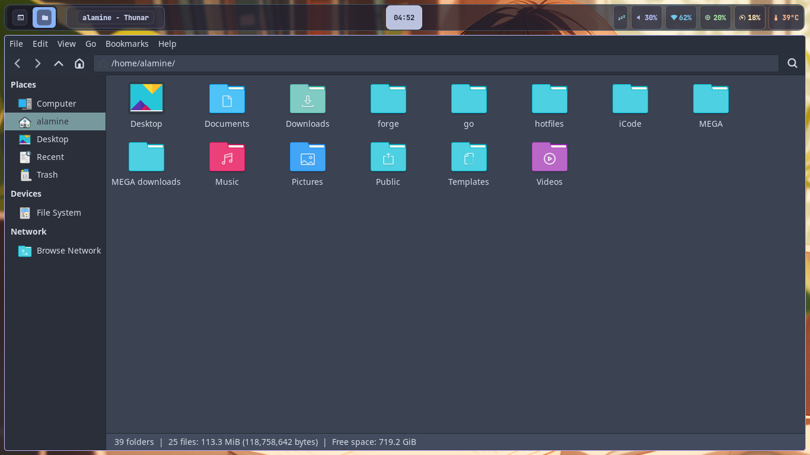
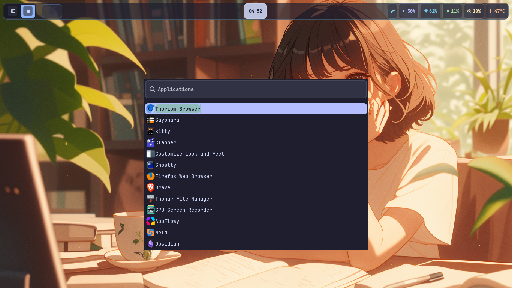
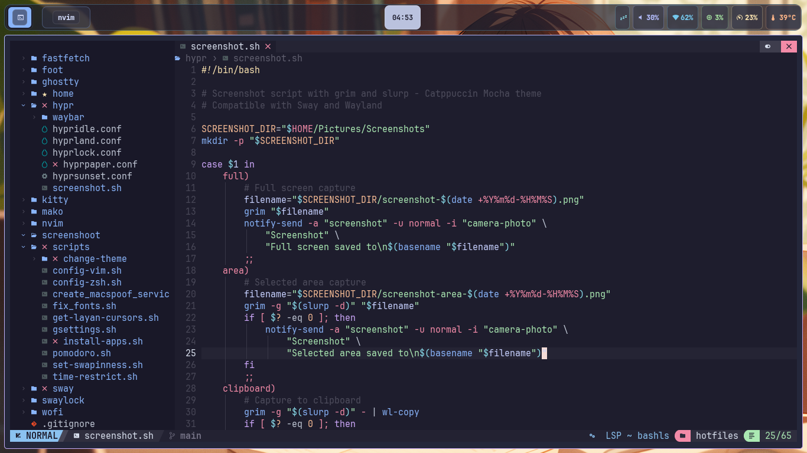

<div align="center">
    <h1>【 petit-rice 】</h1>
    <h3></h3>
</div>


<div align="center"> 


</div>


This repository contains my personal Linux configuration for Hyprland and Sway. My goal for this configuration is to provide a modern, beautiful, productive, and simple workflow with extensive theme support, making it very easy to configure your own themes.

I've created a script (`install.sh`) that allows for a quick installation of my work environment, as well as backup and restoration capabilities.

## 📸 Screenshots

<div align="center">

### Desktop Overview


### Terminal


### File Manager


### Application Launcher


### Neovim


</div>

## ✨ Features

*   **Modern Workflow**: Designed for a smooth and efficient user experience.
*   **Extensive Theming**: Easy to switch between themes and add new ones.
*   **Automated Setup**: Simple installation, backup, and restore processes.
*   **Consistent Keybindings**: Unified keybindings for both Hyprland and Sway.

## 🎨 Supported Themes

Currently supported themes:
*   `catppuccin-macchiato` (dark)
*   `rose-pine-dawn` (light)
*   `gruvbox-dark`

Themes under development:
*   `catppuccin-mocha`
*   `catppuccin-latte`
*   `catppuccin-frappe`
*   `rose-pine-moon` (dark)
*   `gruvbox-light`
*   `nord`

## 🚀 Covered Applications

This configuration covers the following applications:
*   **Terminal Emulators**: `foot`, `ghostty`
*   **Bar**: `waybar`
*   **Notifications**: `mako`
*   **Application Launcher**: `wofi`
*   **Text Editors**: `nvim`, `vim`
*   **System Info**: `fastfetch`
*   **utilitary**: `yazi`, `onefetch`, `hyprlock`, `swaylock-effects`, `slurp`

yazi : yazi is a simple and fast terminal file manager.
onefetch : command-line git information tool.
hyprlock : hyprland lockscreen .
swaylock-effects : a simple lockscreen for sway.
slurp :  simple screenshot tool by selecting a region.


## ⚙️ Installation

To get started, clone the repository and run the installation script:

```bash
git clone --depth 1 https://github.com/alaminedione/petit-rice.git
cd petit-rice
./install.sh
```

For a detailed explanation of the `install.sh` script, its options, and how to use it, please refer to the  [Installation Guide ](docs/GUIDE_INSTALLATION.md).

For a complete and up-to-date list of keybindings, please refer to the [Keybindings Guide](docs/KEYBINDINGS.md).

For more detailed information on backup and restoration, please refer to the [Backup and Restore Guide](docs/BACKUP_AND_RESTORE.md).

## 🎨 How to Change Themes

Themes can be changed using the scripts located in `scripts/change-theme/`. For example, to apply the `catppuccin-mocha` theme:

```bash
./scripts/change-theme/set-mocha.sh
```

To apply the `rose-pine-dawn` theme:

```bash
./scripts/change-theme/set-rose-pine-dawn.sh
```

After changing a theme, it's recommended to restart your applications or session to see all changes applied.

For a detailed guide on how to add a new theme, please refer to the [How to Add a New Theme Guide](docs/HOW_TO_ADD_THEME.md).


## ⚠️ Important Notes

*   **Restart Required**: After installation or restoration, it's recommended to restart your session to apply all changes.
*   **Permissions**: Ensure that `install.sh` and `restore.sh` are executable (`chmod +x install.sh restore.sh`).

## 🤝 Support

For any issues or suggestions, please open an issue on the project's GitHub repository.
